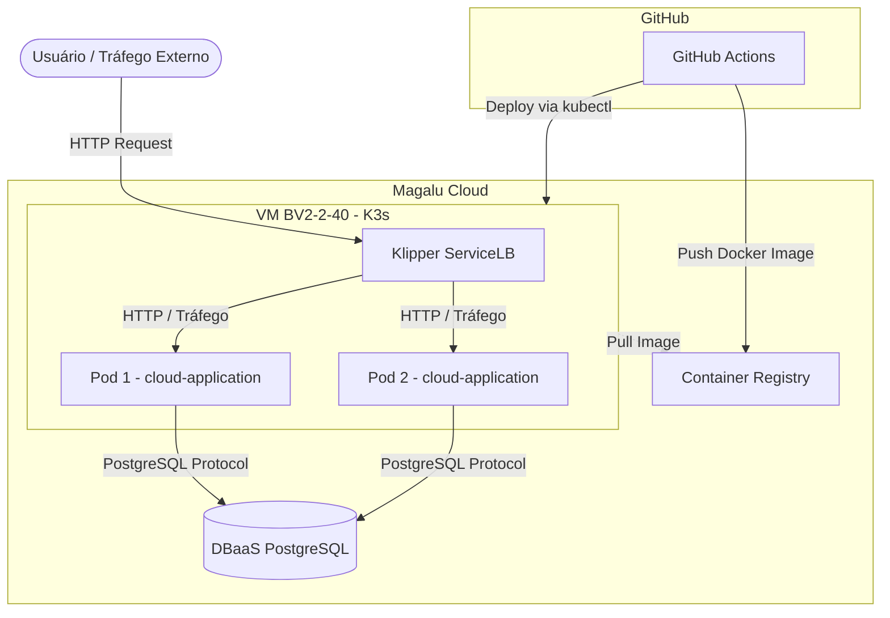

# Arquitetura da Solução

## Diagrama de Arquitetura (C2)

## Componentes da Arquitetura

| Componente | Serviço MGC | Função |
| :--- | :--- | :--- |
| **API** | K3s (VM single node) 2 réplicas | Processa as requisições HTTP |
| **Banco de dados** | DBaaS PostgreSQL | Persiste pedidos e itens |
| **Imagens** | Container Registry | Armazena versões da aplicação |
| **Tráfego externo** | Klipper ServiceLB (IP da VM, porta 80) | Distribui entre as réplicas e fornece acesso externo |
| **CI/CD** | GitHub Actions | Automatiza testes, build e deploy |

## Requisitos Não-Funcionais

| Requisito | Como medir | Alvo |
| :--- | :--- | :--- |
| **Disponibilidade** | Erros 5xx e uptime das probes no Grafana | 99,5% mensal |
| **Latência** | `histogram_quantile(0.95, ...)` do `/metrics` | P95 < 500 ms |
| **Escalabilidade** | Teste de carga (k6) + `rate(http_requests_total)` | 300 req/s sem degradar |
| **Custo** | VM + DBaaS + IP na calculadora MGC | Teto definido em ADR |

## Estilo Arquitetural

A solução segue o estilo de um **monolito em camadas** (apresentação → serviço → dados), implantado como container único com duas réplicas. O estilo-alvo, caso o domínio de notificações cresça, seria extrair um segundo serviço.

## Análise de Trade-offs

| Aspecto | Decisão tomada | Alternativa não escolhida | Motivo da escolha |
| :--- | :--- | :--- | :--- |
| **Deploy** | K3s em VM | MKS (Kubernetes Gerenciado) | Custo menor, provisionamento < 2 min, manifests idênticos |
| **Banco** | DBaaS gerenciado | PostgreSQL em container | Backup automático, sem administração |
| **CI/CD** | GitHub Actions | Deploy manual | Consistência e rastreabilidade |
| **Réplicas** | 2 pods | 1 pod | Disponibilidade mínima sem custo excessivo |
| **API** | FastAPI (Python) | Node.js, Go, Java | Curva de aprendizado baixa, alta produtividade |

## Pontos de Melhoria e Próximos Passos

A aplicação é stateless, então escala na horizontal - mais réplicas atrás do balanceador. Hoje são 2 réplicas fixas; o próximo passo natural é o HPA (Horizontal Pod Autoscaler), que ajusta esse número automaticamente pela utilização de CPU (ex.: mínimo 2, máximo 6, alvo de 70%). Vale registrar também que mais réplicas não resolvem um gargalo de banco - o PostgreSQL escala na vertical e costuma saturar primeiro.

| Melhoria | Por quê |
| :--- | :--- |
| **HTTPS/TLS** | Toda API em produção deve ser acessada por HTTPS |
| **Autoscaler (HPA)** | Escala automaticamente conforme a carga |
| **Versionamento de API** | `/v1/orders` permite evoluir sem quebrar clientes |
| **Rate limiting** | Evita abuso e protege o banco de sobrecargas |
| **Cache (Redis)** | Reduz consultas repetidas ao banco |
| **Migrações de schema (Alembic)** | Controle de versão das mudanças no banco |
| **Testes de carga** | Valida o comportamento sob alto tráfego |
| **Migrar para MKS** | Quando precisar de HA real: basta trocar o kubeconfig - os manifests YAML são idênticos |